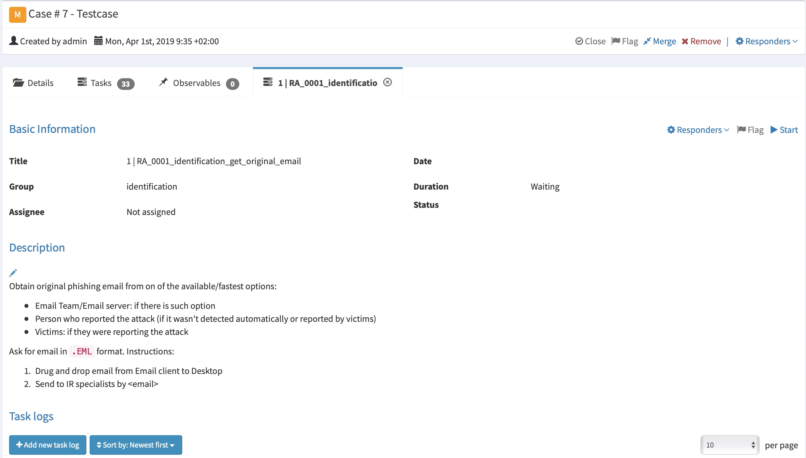

# RE&CT-FR

L'objectif de ce fork est de traduire et adapter le framework RE&CT de AtomicThreatCoverage pour une utilisation française.    
[Github du projet original](https://github.com/atc-project/atc-react)

Nous conservons à l'identique les "Response Stage" et "Response Actions" que nous traduisons en français.    
Nous adaptons les descriptions afin de tenter de les rendre les plus pertinentes possible.

The RE&CT Framework is designed for accumulating, describing and categorizing actionable Incident Response techniques.  

RE&CT's philosophy is based on the [MITRE's ATT&CK](https://attack.mitre.org/) framework.  
The columns represent [Response Stages](responsestages.md).  
The cells repsresent [Response Actions](#response-action).  

The main use cases are:

- Prioritization of Incident Response capabilities development, including skills development, technical measures acquisition/deployment, internal procedures development, etc
- Gap analysis — determine "coverage" of existing Incident Response capabilities

The main resources:

- [RE&CT Navigator](https://atc-project.github.io/react-navigator/) (modified [ATT&CK Navigator](https://github.com/mitre-attack/attack-navigator)) for visualization and observing the big picture  
- Automatically generated RE&CT [website](https://crypt-0n.github.io/react-fr/) is the best place for getting details about existing analytics  
- Automatically generated [Atlassian Confluence knowledge base](https://atomicthreatcoverage.atlassian.net/wiki/spaces/REACT/pages/755469668/Response+Stages) - exporting functionality demonstration  

| Preparation                                                   | Identification                                     | Containment                                    | Eradication                                 | Recovery                                | Lessons Learned                        |
|:-------------------------------------------------------------:|:--------------------------------------------------:|:----------------------------------------------:|:-------------------------------------------:|:---------------------------------------:|:--------------------------------------:|
| [**RA1001: S'exercer**]                                                | [List victims of security alert*]                  | [Patch vulnerability*]                         | [**Report incident to external companies**] | [Reinstall host from golden image*]     | [**Develop incident report**]          |
| [**Take trainings**]                                          | [List host vulnerabilities*]                       | [**Block external IP address**]                | [Remove rogue network device*]              | [Restore data from backup*]             | [**Conduct lessons learned exercise**] |
| [**Raise personnel awareness**]                               | [**Put compromised accounts on monitoring**]       | [**Block internal IP address**]                | [**Delete email message**]                  | [**Unblock blocked IP**]                |                                        |
| [**Make personnel report suspicious activity**]               | [List hosts communicated with internal domain*]    | [**Block external domain**]                    | [Remove file*]                              | [**Unblock blocked domain**]            |                                        |
| [Set up relevant data collection*]                            | [List hosts communicated with internal IP*]        | [**Block internal domain**]                    | [Remove registry key*]                      | [**Unblock blocked URL**]               |                                        |
| [Set up a centralized long-term log storage*]                 | [List hosts communicated with internal URL*]       | [**Block external URL**]                       | [Remove service*]                           | [Unblock blocked port*]                 |                                        |
| [Develop communication map*]                                  | [Analyse domain name*]                             | [**Block internal URL**]                       | [**Revoke authentication credentials**]     | [Unblock blocked user*]                 |                                        |
| [Make sure there are backups*]                                | [Analyse IP*]                                      | [**Block port external communication**]        | [Remove user account*]                      | [**Unblock domain on email**]           |                                        |
| [Get network architecture map*]                               | [Analyse URI*]                                     | [**Block port internal communication**]        |                                             | [**Unblock sender on email**]           |                                        |
| [Get access control matrix*]                                  | [List hosts communicated by port*]                 | [**Block user external communication**]        |                                             | [**Restore quarantined email message**] |                                        |
| [Develop assets knowledge base*]                              | [List hosts connected to VPN*]                     | [**Block user internal communication**]        |                                             | [Restore quarantined file*]             |                                        |
| [Check analysis toolset*]                                     | [List hosts connected to intranet*]                | [Block data transferring by content pattern*]  |                                             | [Unblock blocked process*]              |                                        |
| [Access vulnerability management system logs*]                | [List data transferred*]                           | [**Block domain on email**]                    |                                             | [Enable disabled service*]              |                                        |
| [**Connect with trusted communities**]                        | [Collect transferred data*]                        | [**Block sender on email**]                    |                                             | [Unlock locked user account*]           |                                        |
| [**Access external network flow logs**]                       | [Identify transferred data*]                       | [**Quarantine email message**]                 |                                             |                                         |                                        |
| [Access internal network flow logs*]                          | [**List hosts communicated with external domain**] | [Quarantine file by format*]                   |                                             |                                         |                                        |
| [Access internal HTTP logs*]                                  | [**List hosts communicated with external IP**]     | [Quarantine file by hash*]                     |                                             |                                         |                                        |
| [**Access external HTTP logs**]                               | [**List hosts communicated with external URL**]    | [Quarantine file by path*]                     |                                             |                                         |                                        |
| [Access internal DNS logs*]                                   | [Find data transferred by content pattern*]        | [Quarantine file by content pattern*]          |                                             |                                         |                                        |
| [**Access external DNS logs**]                                | [Analyse user-agent*]                              | [Block process by executable path*]            |                                             |                                         |                                        |
| [Access VPN logs*]                                            | [**List users opened email message**]              | [Block process by executable metadata*]        |                                             |                                         |                                        |
| [Access DHCP logs*]                                           | [**Collect email message**]                        | [Block process by executable hash*]            |                                             |                                         |                                        |
| [Access internal packet capture data*]                        | [**List email message receivers**]                 | [Block process by executable format*]          |                                             |                                         |                                        |
| [Access external packet capture data*]                        | [**Make sure email message is phishing**]          | [Block process by executable content pattern*] |                                             |                                         |                                        |
| [**Get ability to block external IP address**]                | [**Extract observables from email message**]       | [Disable system service*]                      |                                             |                                         |                                        |
| [Get ability to block internal IP address*]                   | [Analyse email address*]                           | [Lock user account*]                           |                                             |                                         |                                        |
| [**Get ability to block external domain**]                    | [List files created*]                              |                                                |                                             |                                         |                                        |
| [Get ability to block internal domain*]                       | [List files modified*]                             |                                                |                                             |                                         |                                        |
| [**Get ability to block external URL**]                       | [List files deleted*]                              |                                                |                                             |                                         |                                        |
| [Get ability to block internal URL*]                          | [List files downloaded*]                           |                                                |                                             |                                         |                                        |
| [Get ability to block port external communication*]           | [List files with tampered timestamps*]             |                                                |                                             |                                         |                                        |
| [Get ability to block port internal communication*]           | [Find file by path*]                               |                                                |                                             |                                         |                                        |
| [Get ability to block user external communication*]           | [Find file by metadata*]                           |                                                |                                             |                                         |                                        |
| [Get ability to block user internal communication*]           | [Find file by hash*]                               |                                                |                                             |                                         |                                        |
| [Get ability to find data transferred by content pattern*]    | [Find file by format*]                             |                                                |                                             |                                         |                                        |
| [Get ability to block data transferring by content pattern*]  | [Find file by content pattern*]                    |                                                |                                             |                                         |                                        |
| [Get ability to list data transferred*]                       | [Collect file*]                                    |                                                |                                             |                                         |                                        |
| [Get ability to collect transferred data*]                    | [Analyse file hash*]                               |                                                |                                             |                                         |                                        |
| [Get ability to identify transferred data*]                   | [Analyse Windows PE*]                              |                                                |                                             |                                         |                                        |
| [Find data transferred by content pattern*]                   | [Analyse macos macho*]                             |                                                |                                             |                                         |                                        |
| [Get ability to analyse user-agent*]                          | [Analyse Unix ELF*]                                |                                                |                                             |                                         |                                        |
| [**Get ability to list users opened email message**]          | [Analyse MS office file*]                          |                                                |                                             |                                         |                                        |
| [**Get ability to list email message receivers**]             | [Analyse PDF file*]                                |                                                |                                             |                                         |                                        |
| [**Get ability to block email domain**]                       | [Analyse script*]                                  |                                                |                                             |                                         |                                        |
| [**Get ability to block email sender**]                       | [Analyse jar*]                                     |                                                |                                             |                                         |                                        |
| [**Get ability to delete email message**]                     | [Analyse filename*]                                |                                                |                                             |                                         |                                        |
| [**Get ability to quarantine email message**]                 | [List processes executed*]                         |                                                |                                             |                                         |                                        |
| [Get ability to collect email message*]                       | [Find process by executable path*]                 |                                                |                                             |                                         |                                        |
| [Get ability to analyse email address*]                       | [Find process by executable metadata*]             |                                                |                                             |                                         |                                        |
| [Get ability to list files created*]                          | [Find process by executable hash*]                 |                                                |                                             |                                         |                                        |
| [Get ability to list files modified*]                         | [Find process by executable format*]               |                                                |                                             |                                         |                                        |
| [Get ability to list files deleted*]                          | [Find process by executable content pattern*]      |                                                |                                             |                                         |                                        |
| [Get ability to list files downloaded*]                       | [List registry keys modified*]                     |                                                |                                             |                                         |                                        |
| [Get ability to list files with tampered timestamps*]         | [List registry keys deleted*]                      |                                                |                                             |                                         |                                        |
| [Get ability to find file by path*]                           | [List registry keys accessed*]                     |                                                |                                             |                                         |                                        |
| [Get ability to find file by metadata*]                       | [List registry keys created*]                      |                                                |                                             |                                         |                                        |
| [Get ability to find file by hash*]                           | [List services created*]                           |                                                |                                             |                                         |                                        |
| [Get ability to find file by format*]                         | [List services modified*]                          |                                                |                                             |                                         |                                        |
| [Get ability to find file by content pattern*]                | [List services deleted*]                           |                                                |                                             |                                         |                                        |
| [Get ability to collect file*]                                | [Analyse registry key*]                            |                                                |                                             |                                         |                                        |
| [Get ability to quarantine file by path*]                     | [List users authenticated*]                        |                                                |                                             |                                         |                                        |
| [Get ability to quarantine file by hash*]                     |                                                    |                                                |                                             |                                         |                                        |
| [Get ability to quarantine file by format*]                   |                                                    |                                                |                                             |                                         |                                        |
| [Get ability to quarantine file by content pattern*]          |                                                    |                                                |                                             |                                         |                                        |
| [Get ability to remove file*]                                 |                                                    |                                                |                                             |                                         |                                        |
| [Get ability to analyse file hash*]                           |                                                    |                                                |                                             |                                         |                                        |
| [Get ability to analyse windows pe*]                          |                                                    |                                                |                                             |                                         |                                        |
| [Get ability to analyse macos macho*]                         |                                                    |                                                |                                             |                                         |                                        |
| [Get ability to analyse unix elf*]                            |                                                    |                                                |                                             |                                         |                                        |
| [Get ability to analyse ms office file*]                      |                                                    |                                                |                                             |                                         |                                        |
| [Get ability to analyse pdf file*]                            |                                                    |                                                |                                             |                                         |                                        |
| [Get ability to analyse script*]                              |                                                    |                                                |                                             |                                         |                                        |
| [Get ability to analyse jar*]                                 |                                                    |                                                |                                             |                                         |                                        |
| [Get ability to analyse filename*]                            |                                                    |                                                |                                             |                                         |                                        |
| [Get ability to list processes executed*]                     |                                                    |                                                |                                             |                                         |                                        |
| [Get ability to find process by executable path*]             |                                                    |                                                |                                             |                                         |                                        |
| [Get ability to find process by executable metadata*]         |                                                    |                                                |                                             |                                         |                                        |
| [Get ability to find process by executable hash*]             |                                                    |                                                |                                             |                                         |                                        |
| [Get ability to find process by executable format*]           |                                                    |                                                |                                             |                                         |                                        |
| [Get ability to find process by executable content pattern*]  |                                                    |                                                |                                             |                                         |                                        |
| [Get ability to block process by executable path*]            |                                                    |                                                |                                             |                                         |                                        |
| [Get ability to block process by executable metadata*]        |                                                    |                                                |                                             |                                         |                                        |
| [Get ability to block process by executable hash*]            |                                                    |                                                |                                             |                                         |                                        |
| [Get ability to block process by executable format*]          |                                                    |                                                |                                             |                                         |                                        |
| [Get ability to block process by executable content pattern*] |                                                    |                                                |                                             |                                         |                                        |
| [Manage remote computer management system policies*]          |                                                    |                                                |                                             |                                         |                                        |
| [Get ability to list registry keys modified*]                 |                                                    |                                                |                                             |                                         |                                        |
| [Get ability to list registry keys deleted*]                  |                                                    |                                                |                                             |                                         |                                        |
| [Get ability to list registry keys accessed*]                 |                                                    |                                                |                                             |                                         |                                        |
| [Get ability to list registry keys created*]                  |                                                    |                                                |                                             |                                         |                                        |
| [Get ability to list services created*]                       |                                                    |                                                |                                             |                                         |                                        |
| [Get ability to list services modified*]                      |                                                    |                                                |                                             |                                         |                                        |
| [Get ability to list services deleted*]                       |                                                    |                                                |                                             |                                         |                                        |
| [Get ability to remove registry key*]                         |                                                    |                                                |                                             |                                         |                                        |
| [Get ability to remove service*]                              |                                                    |                                                |                                             |                                         |                                        |
| [Get ability to analyse registry key*]                        |                                                    |                                                |                                             |                                         |                                        |
| [Manage identity management system*]                          |                                                    |                                                |                                             |                                         |                                        |
| [Get ability to lock user account*]                           |                                                    |                                                |                                             |                                         |                                        |
| [Get ability to list users authenticated*]                    |                                                    |                                                |                                             |                                         |                                        |
| [Get ability to revoke authentication credentials*]           |                                                    |                                                |                                             |                                         |                                        |
| [Get ability to remove user account*]                         |                                                    |                                                |                                             |                                         |                                        |
|

 

[**RA1001: S'exercer**]: Response_Actions/RA_1001_practice.md
[RA1002: Suivre des formations*]: Response_Actions/RA_1002_take_trainings.md
[RA1003: Sensibiliser le personnel*]: Response_Actions/RA_1003_raise_personnel_awareness.md
[RA1004: Obliger le personnel à signaler une activité suspecte*]: Response_Actions/RA_1004_make_personnel_report_suspicious_activity.md
[RA1005: Mettre en place une collecte de données pertinente*]: Response_Actions/RA_1005_set_up_relevant_data_collection.md
[RA1006: Configurer un stockage centralisé des journaux à long terme*]: Response_Actions/RA_1006_set_up_a_centralized_long-term_log_storage.md
[RA1007: Élaborer une carte de communication*]: Response_Actions/RA_1007_develop_communication_map.md
[RA1008: Assurez-vous qu'il y a des sauvegardes*]: Response_Actions/RA_1008_make_sure_there_are_backups.md
[RA1009: Obtenir la cartographie de l'architecture du réseau*]: Response_Actions/RA_1009_get_network_architecture_map.md
[RA1010: Obtenir la matrice de contrôle d'accès*]: Response_Actions/RA_1010_get_access_control_matrix.md
[RA1011: Développer la base de connaissances des actifs*]: Response_Actions/RA_1011_develop_assets_knowledge_base.md
[RA1012: Vérifier l'ensemble des outils d'analyse*]: Response_Actions/RA_1012_check_analysis_toolset.md
[RA1013: Accéder aux journaux du système de gestion des vulnérabilités*]: Response_Actions/RA_1013_access_vulnerability_management_system_logs.md
[RA1014: Connectez-vous avec des communautés de confiance*]: Response_Actions/RA_1014_connect_with_trusted_communities.md
[RA1101: Accéder aux journaux de flux du réseau externe*]: Response_Actions/RA_1101_access_external_network_flow_logs.md
[RA1102: Accéder aux journaux de flux du réseau interne*]: Response_Actions/RA_1102_access_internal_network_flow_logs.md
[RA1103: Accéder aux journaux HTTP internes*]: Response_Actions/RA_1103_access_internal_http_logs.md
[RA1104: Accéder aux journaux HTTP externes*]: Response_Actions/RA_1104_access_external_http_logs.md
[RA1105: Accéder aux journaux DNS internes*]: Response_Actions/RA_1105_access_internal_dns_logs.md
[RA1106: Accéder aux journaux DNS externes*]: Response_Actions/RA_1106_access_external_dns_logs.md
[RA1107: Accéder aux journaux VPN*]: Response_Actions/RA_1107_access_vpn_logs.md
[RA1108: Accéder aux journaux DHCP*]: Response_Actions/RA_1108_access_dhcp_logs.md
[RA1109: Accéder aux données internes de capture de paquets*]: Response_Actions/RA_1109_access_internal_packet_capture_data.md
[RA1110: Accéder aux données de capture de paquets externes*]: Response_Actions/RA_1110_access_external_packet_capture_data.md
[RA1111: Obtenir la possibilité de bloquer l'adresse IP externe*]: Response_Actions/RA_1111_get_ability_to_block_external_ip_address.md
[RA1112: Obtenir la possibilité de bloquer l'adresse IP interne*]: Response_Actions/RA_1112_get_ability_to_block_internal_ip_address.md
[RA1113: Obtenir la possibilité de bloquer un domaine externe*]: Response_Actions/RA_1113_get_ability_to_block_external_domain.md
[RA1114: Obtenir la possibilité de bloquer le domaine interne*]: Response_Actions/RA_1114_get_ability_to_block_internal_domain.md
[RA1115: Obtenir la possibilité de bloquer l'url externe*]: Response_Actions/RA_1115_get_ability_to_block_external_url.md
[RA1116: Obtenir la possibilité de bloquer l'url interne*]: Response_Actions/RA_1116_get_ability_to_block_internal_url.md
[RA1117: Obtenir la capacité de bloquer la communication externe du port*]: Response_Actions/RA_1117_get_ability_to_block_port_external_communication.md
[RA1118: Obtenir la capacité de bloquer la communication interne du port*]: Response_Actions/RA_1118_get_ability_to_block_port_internal_communication.md
[RA1119: Obtenir la capacité de bloquer la communication externe de l'utilisateur*]: Response_Actions/RA_1119_get_ability_to_block_user_external_communication.md
[RA1120: Obtenir la capacité de bloquer la communication interne de l'utilisateur*]: Response_Actions/RA_1120_get_ability_to_block_user_internal_communication.md
[RA1121: Obtenir la capacité de trouver des données transférées par contenu*]: Response_Actions/RA_1121_get_ability_to_find_data_transferred_by_content_pattern.md
[RA1122: Obtenir la possibilité de bloquer le transfert de données par contenu*]: Response_Actions/RA_1122_get_ability_to_block_data_transferring_by_content_pattern.md
[RA1123: Obtenir la possibilité de répertorier les données transférées*]: Response_Actions/RA_1123_get_ability_to_list_data_transferred.md
[RA1124: Obtenir la possibilité de collecter les données transférées*]: Response_Actions/RA_1124_get_ability_to_collect_transferred_data.md
[RA1125: Obtenir la capacité d'identifier les données transférées*]: Response_Actions/RA_1125_get_ability_to_identify_transferred_data.md
[RA1126: Rechercher des données transférées par contenu*]: Response_Actions/RA_1126_find_data_transferred_by_content_pattern.md
[RA1127: Obtenir la capacité d'analyser les user-agent*]: Response_Actions/RA_1127_get_ability_to_analyse_user-agent.md
[RA1201: Obtenir la possibilité de répertorier les e-mails ouverts des utilisateurs*]: Response_Actions/RA_1201_get_ability_to_list_users_opened_email_message.md
[RA1202: Obtenir la possibilité de répertorier les destinataires des e-mails*]: Response_Actions/RA_1202_get_ability_to_list_email_message_receivers.md
[RA1203: Obtenir la possibilité de bloquer le domaine de messagerie*]: Response_Actions/RA_1203_get_ability_to_block_email_domain.md
[RA1204: Obtenir la possibilité de bloquer l'expéditeur du courrier électronique*]: Response_Actions/RA_1204_get_ability_to_block_email_sender.md
[RA1205: Obtenir la possibilité de supprimer un e-mail*]: Response_Actions/RA_1205_get_ability_to_delete_email_message.md
[RA1206: Obtenir la possibilité de mettre un e-mail en quarantaine*]: Response_Actions/RA_1206_get_ability_to_quarantine_email_message.md
[RA1207: Obtenir la possibilité de collecter un message électronique*]: Response_Actions/RA_1207_get_ability_to_collect_email_message.md
[RA1208: Obtenir la capacité d'analyser l'adresse e-mail*]: Response_Actions/RA_1208_get_ability_to_analyse_email_address.md
[RA1301: Obtenir la possibilité de répertorier les fichiers créés*]: Response_Actions/RA_1301_get_ability_to_list_files_created.md
[RA1302: Obtenir la possibilité de lister les fichiers modifiés*]: Response_Actions/RA_1302_get_ability_to_list_files_modified.md
[RA1303: Obtenir la possibilité de répertorier les fichiers supprimés*]: Response_Actions/RA_1303_get_ability_to_list_files_deleted.md
[RA1304: Obtenir la possibilité de répertorier les fichiers téléchargés*]: Response_Actions/RA_1304_get_ability_to_list_files_downloaded.md
[RA1305: Obtenir la possibilité de répertorier les fichiers avec des horodatages falsifiés*]: Response_Actions/RA_1305_get_ability_to_list_files_with_tampered_timestamps.md
[RA1306: Obtenir la possibilité de trouver un fichier par chemin*]: Response_Actions/RA_1306_get_ability_to_find_file_by_path.md
[RA1307: Obtenir la possibilité de trouver un fichier par métadonnées*]: Response_Actions/RA_1307_get_ability_to_find_file_by_metadata.md
[RA1308: Obtenir la capacité de trouver un fichier par hash*]: Response_Actions/RA_1308_get_ability_to_find_file_by_hash.md
[RA1309: Obtenir la possibilité de trouver un fichier par format*]: Response_Actions/RA_1309_get_ability_to_find_file_by_format.md
[RA1310: Obtenir la possibilité de trouver un fichier par contenu*]: Response_Actions/RA_1310_get_ability_to_find_file_by_content_pattern.md
[RA1311: Obtenir la possibilité de collecter un fichier*]: Response_Actions/RA_1311_get_ability_to_collect_file.md
[RA1312: Obtenir la possibilité de mettre le fichier en quarantaine par chemin*]: Response_Actions/RA_1312_get_ability_to_quarantine_file_by_path.md
[RA1313: Obtenir la possibilité de mettre le fichier en quarantaine par le hash*]: Response_Actions/RA_1313_get_ability_to_quarantine_file_by_hash.md
[RA1314: Obtenir la possibilité de mettre le fichier en quarantaine par format*]: Response_Actions/RA_1314_get_ability_to_quarantine_file_by_format.md
[RA1315: Obtenir la possibilité de mettre le fichier en quarantaine par contenu*]: Response_Actions/RA_1315_get_ability_to_quarantine_file_by_content_pattern.md
[RA1316: Obtenir la possibilité de supprimer un fichier*]: Response_Actions/RA_1316_get_ability_to_remove_file.md
[RA1317: Obtenir la capacité d'analyser le hash d'un fichier*]: Response_Actions/RA_1317_get_ability_to_analyse_file_hash.md
[RA1318: Obtenir la capacité d'analyser les PE Windows*]: Response_Actions/RA_1318_get_ability_to_analyse_windows_pe.md
[RA1319: Obtenir la capacité d'analyser les fichiers Mach-o de macos*]: Response_Actions/RA_1319_get_ability_to_analyse_macos_macho.md
[RA1320: Obtenir la capacité d'analyser un fichier ELF Unix*]: Response_Actions/RA_1320_get_ability_to_analyse_unix_elf.md
[RA1321: Obtenir la capacité d'analyser les fichiers MS office*]: Response_Actions/RA_1321_get_ability_to_analyse_ms_office_file.md
[RA1322: Obtenir la capacité d'analyser un fichier PDF*]: Response_Actions/RA_1322_get_ability_to_analyse_pdf_file.md
[RA1323: Obtenir la capacité d'analyser un script*]: Response_Actions/RA_1323_get_ability_to_analyse_script.md
[RA1324: Obtenir la capacité d'analyser un fichier jar*]: Response_Actions/RA_1324_get_ability_to_analyse_jar.md
[RA1325: Obtenir la capacité d'analyser le nom de fichier*]: Response_Actions/RA_1325_get_ability_to_analyse_filename.md
[RA1401: Obtenir la possibilité de répertorier les processus exécutés*]: Response_Actions/RA_1401_get_ability_to_list_processes_executed.md
[RA1402: Obtenir la capacité de trouver un processus par un chemin exécutable*]: Response_Actions/RA_1402_get_ability_to_find_process_by_executable_path.md
[RA1403: Obtenir la capacité de trouver un processus par les métadonnées d'un exécutable*]: Response_Actions/RA_1403_get_ability_to_find_process_by_executable_metadata.md
[RA1404: Obtenir la capacité de trouver un processus exécutable par le hash*]: Response_Actions/RA_1404_get_ability_to_find_process_by_executable_hash.md
[RA1405: Obtenir la capacité de trouver un processus exécutable par son format*]: Response_Actions/RA_1405_get_ability_to_find_process_by_executable_format.md
[RA1406: Obtenir la capacité de trouver un processus exécutable par un contenu*]: Response_Actions/RA_1406_get_ability_to_find_process_by_executable_content_pattern.md
[RA1407: Obtenir la possibilité de bloquer le processus par le chemin de l'exécutable*]: Response_Actions/RA_1407_get_ability_to_block_process_by_executable_path.md
[RA1408: Obtenir la possibilité de bloquer le processus par les métadonnées de l'exécutables*]: Response_Actions/RA_1408_get_ability_to_block_process_by_executable_metadata.md
[RA1409: Obtenir la capacité de bloquer le processus par le hash de l'exécutable*]: Response_Actions/RA_1409_get_ability_to_block_process_by_executable_hash.md
[RA1410: Obtenir la possibilité de bloquer le processus par le format de l'exécutable*]: Response_Actions/RA_1410_get_ability_to_block_process_by_executable_format.md
[RA1411: Obtenir la possibilité de bloquer le processus par le contenu de l'exécutable*]: Response_Actions/RA_1411_get_ability_to_block_process_by_executable_content_pattern.md
[RA1501: Gérer les politiques du système de gestion des ordinateurs distants*]: Response_Actions/RA_1501_manage_remote_computer_management_system_policies.md
[RA1502: Obtenir la possibilité de lister les clés de registre modifiées*]: Response_Actions/RA_1502_get_ability_to_list_registry_keys_modified.md
[RA1503: Obtenir la possibilité de répertorier les clés de registre supprimées*]: Response_Actions/RA_1503_get_ability_to_list_registry_keys_deleted.md
[RA1504: Obtenir la liste des clés de registre accédées*]: Response_Actions/RA_1504_get_ability_to_list_registry_keys_accessed.md
[RA1505: Obtenir la liste des clés de registre créées*]: Response_Actions/RA_1505_get_ability_to_list_registry_keys_created.md
[RA1506: Obtenir la possibilité de répertorier les services créés*]: Response_Actions/RA_1506_get_ability_to_list_services_created.md
[RA1507: Obtenir la possibilité de lister les services modifiés*]: Response_Actions/RA_1507_get_ability_to_list_services_modified.md
[RA1508: Obtenir la possibilité de répertorier les services supprimés*]: Response_Actions/RA_1508_get_ability_to_list_services_deleted.md
[RA1509: Obtenir la possibilité de supprimer une clé de registre*]: Response_Actions/RA_1509_get_ability_to_remove_registry_key.md
[RA1510: Obtenir la possibilité de supprimer un service*]: Response_Actions/RA_1510_get_ability_to_remove_service.md
[RA1511: Obtenir la capacité d'analyser une clé de registre*]: Response_Actions/RA_1511_get_ability_to_analyse_registry_key.md
[RA1601: Gérer le système de gestion des identités*]: Response_Actions/RA_1601_manage_identity_management_system.md
[RA1602: Obtenir la possibilité de verrouiller un compte utilisateur*]: Response_Actions/RA_1602_get_ability_to_lock_user_account.md
[RA1603: Obtenir la possibilité de répertorier les utilisateurs authentifiés*]: Response_Actions/RA_1603_get_ability_to_list_users_authenticated.md
[RA1604: Obtenir la possibilité de révoquer les informations d'authentification*]: Response_Actions/RA_1604_get_ability_to_revoke_authentication_credentials.md
[RA1605: Obtenir la possibilité de supprimer un compte utilisateur*]: Response_Actions/RA_1605_get_ability_to_remove_user_account.md

[RA2001: Répertorier les victimes de l'alerte de sécurité*]: Response_Actions/RA_2001_list_victims_of_security_alert.md
[RA2002: Répertorier les vulnérabilités de l'hôte*]: Response_Actions/RA_2002_list_host_vulnerabilities.md
[RA2003: Mettre des comptes compromis sous surveillance*]: Response_Actions/RA_2003_put_compromised_accounts_on_monitoring.md
[RA2101: Liste des hôtes qui ont communiqués avec le domaine interne*]: Response_Actions/RA_2101_list_hosts_communicated_with_internal_domain.md
[RA2102: Liste des hôtes qui ont communiqués avec l'ip interne*]: Response_Actions/RA_2102_list_hosts_communicated_with_internal_ip.md
[RA2103: Liste des hôtes qui ont communiqués avec une URL interne*]: Response_Actions/RA_2103_list_hosts_communicated_with_internal_url.md
[RA2104: Analyser le nom de domaine*]: Response_Actions/RA_2104_analyse_domain_name.md
[RA2105: Analyser l'ip*]: Response_Actions/RA_2105_analyse_ip.md
[RA2106: Analyser l'uri*]: Response_Actions/RA_2106_analyse_uri.md
[RA2107: Liste des hôtes qui ont communiqués par port*]: Response_Actions/RA_2107_list_hosts_communicated_by_port.md
[RA2108: Liste des hôtes connectés au VPN*]: Response_Actions/RA_2108_list_hosts_connected_to_vpn.md
[RA2109: Liste des hôtes connectés à l'intranet*]: Response_Actions/RA_2109_list_hosts_connected_to_intranet.md
[RA2110: Liste des données transférées*]: Response_Actions/RA_2110_list_data_transferred.md
[RA2111: Collecter les données transférées*]: Response_Actions/RA_2111_collect_transferred_data.md
[RA2112: Identifier les données transférées*]: Response_Actions/RA_2112_identify_transferred_data.md
[RA2113: Lister les hôtes qui ont communiqués avec un domaine externe*]: Response_Actions/RA_2113_list_hosts_communicated_with_external_domain.md
[RA2114: Lister les hôtes qui ont communiqués avec une IP externe*]: Response_Actions/RA_2114_list_hosts_communicated_with_external_ip.md
[RA2115: Lister les hôtes qui ont communiqués avec une URL externe*]: Response_Actions/RA_2115_list_hosts_communicated_with_external_url.md
[RA2116: Rechercher des données transférées par contenu*]: Response_Actions/RA_2116_find_data_transferred_by_content_pattern.md
[RA2117: Analyser un user-agent*]: Response_Actions/RA_2117_analyse_user-agent.md
[RA2201: Lister les utilisateurs qui ont ouverts un e-mail*]: Response_Actions/RA_2201_list_users_opened_email_message.md
[RA2202: Collecter l'e-mail*]: Response_Actions/RA_2202_collect_email_message.md
[RA2203: Lister les destinataires d'un e-mails*]: Response_Actions/RA_2203_list_email_message_receivers.md
[RA2204: Assurez-vous que le message électronique est du phishing*]: Response_Actions/RA_2204_make_sure_email_message_is_phishing.md
[RA2205: Extraire les observables du message électronique*]: Response_Actions/RA_2205_extract_observables_from_email_message.md
[RA2206: Analyser l'adresse e-mail*]: Response_Actions/RA_2206_analyse_email_address.md
[RA2301: Lister les fichiers créés*]: Response_Actions/RA_2301_list_files_created.md
[RA2302: Lister les fichiers modifiés*]: Response_Actions/RA_2302_list_files_modified.md
[RA2303: Lister les fichiers supprimés*]: Response_Actions/RA_2303_list_files_deleted.md
[RA2304: Lister les fichiers téléchargés*]: Response_Actions/RA_2304_list_files_downloaded.md
[RA2305: Lister les fichiers avec des horodatages falsifiés*]: Response_Actions/RA_2305_list_files_with_tampered_timestamps.md
[RA2306: Rechercher un fichier par son chemin*]: Response_Actions/RA_2306_find_file_by_path.md
[RA2307: Rechercher un fichier par métadonnées*]: Response_Actions/RA_2307_find_file_by_metadata.md
[RA2308: Rechercher un fichier par son hash*]: Response_Actions/RA_2308_find_file_by_hash.md
[RA2309: Rechercher un fichier par son format*]: Response_Actions/RA_2309_find_file_by_format.md
[RA2310: Rechercher un fichier par contenu*]: Response_Actions/RA_2310_find_file_by_content_pattern.md
[RA2311: Collecter le fichier*]: Response_Actions/RA_2311_collect_file.md
[RA2312: Analyser un fchier via son hash*]: Response_Actions/RA_2312_analyse_file_hash.md
[RA2313: Analyser un PE Windows*]: Response_Actions/RA_2313_analyse_windows_pe.md
[RA2314: Analyser un fichier Mach-o de macos*]: Response_Actions/RA_2314_analyse_macos_macho.md
[RA2315: Analyser un fichier ELF Unix*]: Response_Actions/RA_2315_analyse_unix_elf.md
[RA2316: Analyser le fichier MS office*]: Response_Actions/RA_2316_analyse_ms_office_file.md
[RA2317: Analyser un fichier PDF*]: Response_Actions/RA_2317_analyse_pdf_file.md
[RA2318: Analyser un script*]: Response_Actions/RA_2318_analyse_script.md
[RA2319: Analyser un fichier jar*]: Response_Actions/RA_2319_analyse_jar.md
[RA2320: Analyser le nom de fichier*]: Response_Actions/RA_2320_analyse_filename.md
[RA2401: Lister les processus exécutés*]: Response_Actions/RA_2401_list_processes_executed.md
[RA2402: Rechercher un processus exécutable via son chemin*]: Response_Actions/RA_2402_find_process_by_executable_path.md
[RA2403: Rechercher un processus exécutables par métadonnées*]: Response_Actions/RA_2403_find_process_by_executable_metadata.md
[RA2404: Rechercher un processus par le hash de l'exécutable*]: Response_Actions/RA_2404_find_process_by_executable_hash.md
[RA2405: Rechercher un processus par le format de l'exécutable*]: Response_Actions/RA_2405_find_process_by_executable_format.md
[RA2406: Rechercher un processus par contenu de l'exécutable*]: Response_Actions/RA_2406_find_process_by_executable_content_pattern.md
[RA2501: Lister les clés de registre modifiées*]: Response_Actions/RA_2501_list_registry_keys_modified.md
[RA2502: Lister les clés de registre supprimées*]: Response_Actions/RA_2502_list_registry_keys_deleted.md
[RA2503: Lister les clés de registre accédées*]: Response_Actions/RA_2503_list_registry_keys_accessed.md
[RA2504: Lister les clés de registre créées*]: Response_Actions/RA_2504_list_registry_keys_created.md
[RA2505: Lister les services créés*]: Response_Actions/RA_2505_list_services_created.md
[RA2506: Lister les services modifiés*]: Response_Actions/RA_2506_list_services_modified.md
[RA2507: Lister les services supprimés*]: Response_Actions/RA_2507_list_services_deleted.md
[RA2508: Analyser la clé de registre*]: Response_Actions/RA_2508_analyse_registry_key.md
[RA2601: Répertorier les utilisateurs authentifiés*]: Response_Actions/RA_2601_list_users_authenticated.md

[RA3001: Patch vulnerability*]: Response_Actions/RA_3001_patch_vulnerability.md
[RA3101: Bloquer l'adresse IP externe*]: Response_Actions/RA_3101_block_external_ip_address.md
[RA3102: Bloquer l'adresse IP interne*]: Response_Actions/RA_3102_block_internal_ip_address.md
[RA3103: Bloquer le domaine externe*]: Response_Actions/RA_3103_block_external_domain.md
[RA3104: Bloquer le domaine interne*]: Response_Actions/RA_3104_block_internal_domain.md
[RA3105: Bloquer l'url externe*]: Response_Actions/RA_3105_block_external_url.md
[RA3106: Bloquer l'url interne*]: Response_Actions/RA_3106_block_internal_url.md
[RA3107: Bloquer le port de communication externe*]: Response_Actions/RA_3107_block_port_external_communication.md
[RA3108: Bloquer le port de communication interne*]: Response_Actions/RA_3108_block_port_internal_communication.md
[RA3109: Bloquer la communication externe de l'utilisateur*]: Response_Actions/RA_3109_block_user_external_communication.md
[RA3110: Bloquer la communication interne de l'utilisateur*]: Response_Actions/RA_3110_block_user_internal_communication.md
[RA3111: Bloquer le transfert de données par contenu*]: Response_Actions/RA_3111_block_data_transferring_by_content_pattern.md
[RA3201: Bloquer le domaine de l'e-mail*]: Response_Actions/RA_3201_block_domain_on_email.md
[RA3202: Bloquer l'expéditeur de l'e-mail*]: Response_Actions/RA_3202_block_sender_on_email.md
[RA3203: Mettre l'e-mail en quarantaine*]: Response_Actions/RA_3203_quarantine_email_message.md
[RA3301: Mettre en quarantaine un fichier en fonction du format*]: Response_Actions/RA_3301_quarantine_file_by_format.md
[RA3302: Mise en quarantaine d'un fichier en fonction du hash*]: Response_Actions/RA_3302_quarantine_file_by_hash.md
[RA3303: Mise en quarantaine d'un fichier en fonction du chemin*]: Response_Actions/RA_3303_quarantine_file_by_path.md
[RA3304: Mise en quarantaine du fichier en fonction du contenu*]: Response_Actions/RA_3304_quarantine_file_by_content_pattern.md
[RA3401: Bloquer le processus par un chemin exécutable*]: Response_Actions/RA_3401_block_process_by_executable_path.md
[RA3402: Bloquer le processus par des métadonnées exécutables*]: Response_Actions/RA_3402_block_process_by_executable_metadata.md
[RA3403: Bloquer l'execution de processus par le hash*]: Response_Actions/RA_3403_block_process_by_executable_hash.md
[RA3404: Bloquer l'execution de processus par le format*]: Response_Actions/RA_3404_block_process_by_executable_format.md
[RA3405: Bloquer l'execution de processus par le contenu*]: Response_Actions/RA_3405_block_process_by_executable_content_pattern.md
[RA3501: Désactiver le service système*]: Response_Actions/RA_3501_disable_system_service.md
[RA3601: Verrouiller le compte utilisateur*]: Response_Actions/RA_3601_lock_user_account.md

[RA4001: Signaler l'incident aux sociétés externes*]: Response_Actions/RA_4001_report_incident_to_external_companies.md
[RA4101: Supprimer le périphérique réseau non autorisé*]: Response_Actions/RA_4101_remove_rogue_network_device.md
[RA4201: Supprimer l'e-mail*]: Response_Actions/RA_4201_delete_email_message.md
[RA4301: Effacer le fichier*]: Response_Actions/RA_4301_remove_file.md
[RA4501: Supprimer la clé de registre*]: Response_Actions/RA_4501_remove_registry_key.md
[RA4502: Supprimer le service*]: Response_Actions/RA_4502_remove_service.md
[RA4601: Révoquer les informations d'authentification*]: Response_Actions/RA_4601_revoke_authentication_credentials.md
[RA4602: Supprimer le compte utilisateur*]: Response_Actions/RA_4602_remove_user_account.md

[RA5001: Réinstaller l'hôte à partir d'une image propre*]: Response_Actions/RA_5001_reinstall_host_from_golden_image.md
[RA5002: Restaurer les données à partir de la sauvegarde*]: Response_Actions/RA_5002_restore_data_from_backup.md
[RA5101: Débloquer l'ip bloquée*]: Response_Actions/RA_5101_unblock_blocked_ip.md
[RA5102: Débloquer le domaine bloqué*]: Response_Actions/RA_5102_unblock_blocked_domain.md
[RA5103: Débloquer l'url bloquée*]: Response_Actions/RA_5103_unblock_blocked_url.md
[RA5104: Débloquer le port bloqué*]: Response_Actions/RA_5104_unblock_blocked_port.md
[RA5105: Débloquer l'utilisateur bloqué*]: Response_Actions/RA_5105_unblock_blocked_user.md
[RA5201: Débloquer le domaine de l'e-mail*]: Response_Actions/RA_5201_unblock_domain_on_email.md
[RA5202: Débloquer l'expéditeur de l'e-mail*]: Response_Actions/RA_5202_unblock_sender_on_email.md
[RA5203: Restaurer un e-mail en quarantaine*]: Response_Actions/RA_5203_restore_quarantined_email_message.md
[RA5301: Restaurer le fichier en quarantaine*]: Response_Actions/RA_5301_restore_quarantined_file.md
[RA5401: Débloquer le processus bloqué*]: Response_Actions/RA_5401_unblock_blocked_process.md
[RA5501: Activer le service désactivé*]: Response_Actions/RA_5501_enable_disabled_service.md
[RA5601: Déverrouiller le compte utilisateur verrouillé*]: Response_Actions/RA_5601_unlock_locked_user_account.md

[RA6001: Élaborer un rapport d'incident*]: Response_Actions/RA_6001_develop_incident_report.md
[RA6002: Effectuer un exercice sur les leçons apprises"Response_Actions/RA_6002_conduct_lessons_learned_exercise.md

[**Practice**]: Response_Actions/RA_1001_practice.md
[**Take trainings**]: Response_Actions/RA_1002_take_trainings.md
[**Raise personnel awareness**]: Response_Actions/RA_1003_raise_personnel_awareness.md
[**Make personnel report suspicious activity**]: Response_Actions/RA_1004_make_personnel_report_suspicious_activity.md
[Set up relevant data collection*]: https://github.com/atc-project/atc-react/issues/132
[Set up a centralized long-term log storage*]: https://github.com/atc-project/atc-react/issues/133
[Develop communication map*]: https://github.com/atc-project/atc-react/issues/134
[Make sure there are backups*]: https://github.com/atc-project/atc-react/issues/135
[Get network architecture map*]: https://github.com/atc-project/atc-react/issues/136
[Get access control matrix*]: https://github.com/atc-project/atc-react/issues/137
[Develop assets knowledge base*]: https://github.com/atc-project/atc-react/issues/138
[Check analysis toolset*]: https://github.com/atc-project/atc-react/issues/139
[Access vulnerability management system logs*]: https://github.com/atc-project/atc-react/issues/140
[**Connect with trusted communities**]: Response_Actions/RA_1014_connect_with_trusted_communities.md

[**Access external network flow logs**]: Response_Actions/RA_1101_access_external_network_flow_logs.md
[Access internal network flow logs*]: https://github.com/atc-project/atc-react/issues/141
[Access internal HTTP logs*]: https://github.com/atc-project/atc-react/issues/142
[**Access external HTTP logs**]: Response_Actions/RA_1104_access_external_http_logs.md
[Access internal DNS logs*]: https://github.com/atc-project/atc-react/issues/143
[**Access external DNS logs**]: Response_Actions/RA_1106_access_external_dns_logs.md
[Access VPN logs*]: https://github.com/atc-project/atc-react/issues/144
[Access DHCP logs*]: https://github.com/atc-project/atc-react/issues/145
[Access internal packet capture data*]: https://github.com/atc-project/atc-react/issues/146
[Access external packet capture data*]: https://github.com/atc-project/atc-react/issues/147
[**Get ability to block external IP address**]: Response_Actions/RA_1111_get_ability_to_block_external_ip_address.md
[Get ability to block internal IP address*]: https://github.com/atc-project/atc-react/issues/148
[**Get ability to block external domain**]: Response_Actions/RA_1113_get_ability_to_block_external_domain.md
[Get ability to block internal domain*]: https://github.com/atc-project/atc-react/issues/149
[**Get ability to block external URL**]: Response_Actions/RA_1115_get_ability_to_block_external_url.md
[Get ability to block internal URL*]: https://github.com/atc-project/atc-react/issues/150
[Get ability to block port external communication*]: https://github.com/atc-project/atc-react/issues/151
[Get ability to block port internal communication*]: https://github.com/atc-project/atc-react/issues/152
[Get ability to block user external communication*]: https://github.com/atc-project/atc-react/issues/153
[Get ability to block user internal communication*]: https://github.com/atc-project/atc-react/issues/154
[Get ability to find data transferred by content pattern*]: https://github.com/atc-project/atc-react/issues/155
[Get ability to analyse user-agent*]: https://github.com/atc-project/atc-react/issues/312
[Get ability to block data transferring by content pattern*]: https://github.com/atc-project/atc-react/issues/156
[Get ability to list data transferred*]: https://github.com/atc-project/atc-react/issues/157
[Get ability to collect transferred data*]: https://github.com/atc-project/atc-react/issues/158
[Get ability to identify transferred data*]: https://github.com/atc-project/atc-react/issues/159
[Find data transferred by content pattern*]: https://github.com/atc-project/atc-react/issues/160
[Analyse user-agent*]: https://github.com/atc-project/atc-react/issues/306
[**Get ability to list users opened email message**]: Response_Actions/RA_1201_get_ability_to_list_users_opened_email_message.md
[**Get ability to list email message receivers**]: Response_Actions/RA_1202_get_ability_to_list_email_message_receivers.md
[**Get ability to block email domain**]: Response_Actions/RA_1203_get_ability_to_block_email_domain.md
[**Get ability to block email sender**]: Response_Actions/RA_1204_get_ability_to_block_email_sender.md
[**Get ability to delete email message**]: Response_Actions/RA_1205_get_ability_to_delete_email_message.md
[**Get ability to quarantine email message**]: Response_Actions/RA_1206_get_ability_to_quarantine_email_message.md
[Get ability to collect email message*]: https://github.com/atc-project/atc-react/issues/161
[Get ability to analyse email address*]: https://github.com/atc-project/atc-react/issues/313
[Get ability to list files created*]: https://github.com/atc-project/atc-react/issues/162
[Get ability to list files modified*]: https://github.com/atc-project/atc-react/issues/163
[Get ability to list files deleted*]: https://github.com/atc-project/atc-react/issues/164
[Get ability to list files downloaded*]: https://github.com/atc-project/atc-react/issues/165
[Get ability to list files with tampered timestamps*]: https://github.com/atc-project/atc-react/issues/166
[Get ability to find file by path*]: https://github.com/atc-project/atc-react/issues/167
[Get ability to find file by metadata*]: https://github.com/atc-project/atc-react/issues/168
[Get ability to find file by hash*]: https://github.com/atc-project/atc-react/issues/169
[Get ability to find file by format*]: https://github.com/atc-project/atc-react/issues/170
[Get ability to find file by content pattern*]: https://github.com/atc-project/atc-react/issues/171
[Get ability to collect file*]: https://github.com/atc-project/atc-react/issues/172
[Get ability to quarantine file by path*]: https://github.com/atc-project/atc-react/issues/173
[Get ability to quarantine file by hash*]: https://github.com/atc-project/atc-react/issues/174
[Get ability to quarantine file by format*]: https://github.com/atc-project/atc-react/issues/175
[Get ability to quarantine file by content pattern*]: https://github.com/atc-project/atc-react/issues/176
[Get ability to remove file*]: https://github.com/atc-project/atc-react/issues/177
[Get ability to analyse file hash*]: https://github.com/atc-project/atc-react/issues/267
[Get ability to analyse windows pe*]: https://github.com/atc-project/atc-react/issues/268
[Get ability to analyse macos macho*]: https://github.com/atc-project/atc-react/issues/269
[Get ability to analyse unix elf*]: https://github.com/atc-project/atc-react/issues/270
[Get ability to analyse ms office file*]: https://github.com/atc-project/atc-react/issues/271
[Get ability to analyse pdf file*]: https://github.com/atc-project/atc-react/issues/272
[Get ability to analyse script*]: https://github.com/atc-project/atc-react/issues/273
[Get ability to analyse jar*]: https://github.com/atc-project/atc-react/issues/314
[Get ability to analyse filename*]: https://github.com/atc-project/atc-react/issues/315
[Get ability to list processes executed*]: https://github.com/atc-project/atc-react/issues/178
[Get ability to find process by executable path*]: https://github.com/atc-project/atc-react/issues/179
[Get ability to find process by executable metadata*]: https://github.com/atc-project/atc-react/issues/180
[Get ability to find process by executable hash*]: https://github.com/atc-project/atc-react/issues/181
[Get ability to find process by executable format*]: https://github.com/atc-project/atc-react/issues/182
[Get ability to find process by executable content pattern*]: https://github.com/atc-project/atc-react/issues/183
[Get ability to block process by executable path*]: https://github.com/atc-project/atc-react/issues/184
[Get ability to block process by executable metadata*]: https://github.com/atc-project/atc-react/issues/185
[Get ability to block process by executable hash*]: https://github.com/atc-project/atc-react/issues/186
[Get ability to block process by executable format*]: https://github.com/atc-project/atc-react/issues/187
[Get ability to block process by executable content pattern*]: https://github.com/atc-project/atc-react/issues/188
[Manage remote computer management system policies*]: https://github.com/atc-project/atc-react/issues/189
[Get ability to list registry keys modified*]: https://github.com/atc-project/atc-react/issues/190
[Get ability to list registry keys deleted*]: https://github.com/atc-project/atc-react/issues/191
[Get ability to list registry keys accessed*]: https://github.com/atc-project/atc-react/issues/192
[Get ability to list registry keys created*]: https://github.com/atc-project/atc-react/issues/193
[Get ability to list services created*]: https://github.com/atc-project/atc-react/issues/194
[Get ability to list services modified*]: https://github.com/atc-project/atc-react/issues/195
[Get ability to list services deleted*]: https://github.com/atc-project/atc-react/issues/196
[Get ability to remove registry key*]: https://github.com/atc-project/atc-react/issues/197
[Get ability to remove service*]: https://github.com/atc-project/atc-react/issues/198
[Get ability to analyse registry key*]: https://github.com/atc-project/atc-react/issues/316
[Manage identity management system*]: https://github.com/atc-project/atc-react/issues/199
[Get ability to lock user account*]: https://github.com/atc-project/atc-react/issues/200
[Get ability to list users authenticated*]: https://github.com/atc-project/atc-react/issues/201
[Get ability to revoke authentication credentials*]: https://github.com/atc-project/atc-react/issues/202
[Get ability to remove user account*]: https://github.com/atc-project/atc-react/issues/203

[List victims of security alert*]: https://github.com/atc-project/atc-react/issues/49
[List host vulnerabilities*]: https://github.com/atc-project/atc-react/issues/204
[**Put compromised accounts on monitoring**]: Response_Actions/RA_2003_put_compromised_accounts_on_monitoring.md
[List hosts communicated with internal domain*]: https://github.com/atc-project/atc-react/issues/45
[List hosts communicated with internal IP*]: https://github.com/atc-project/atc-react/issues/46
[List hosts communicated with internal URL*]: https://github.com/atc-project/atc-react/issues/47
[Analyse domain name*]: https://github.com/atc-project/atc-react/issues/31
[Analyse IP*]: https://github.com/atc-project/atc-react/issues/40
[Analyse URI*]: https://github.com/atc-project/atc-react/issues/32
[List hosts communicated by port*]: https://github.com/atc-project/atc-react/issues/205
[List hosts connected to VPN*]: https://github.com/atc-project/atc-react/issues/206
[List hosts connected to intranet*]: https://github.com/atc-project/atc-react/issues/207
[List data transferred*]: https://github.com/atc-project/atc-react/issues/208
[Collect transferred data*]: https://github.com/atc-project/atc-react/issues/209
[Identify transferred data*]: https://github.com/atc-project/atc-react/issues/210
[**List hosts communicated with external domain**]: Response_Actions/RA_2113_list_hosts_communicated_with_external_domain.md
[**List hosts communicated with external IP**]: Response_Actions/RA_2114_list_hosts_communicated_with_external_ip.md
[**List hosts communicated with external URL**]: Response_Actions/RA_2115_list_hosts_communicated_with_external_url.md
[Find data transferred by content pattern*]: https://github.com/atc-project/atc-react/issues/211
[**List users opened email message**]: Response_Actions/RA_2201_list_users_opened_email_message.md
[**Collect email message**]: Response_Actions/RA_2202_collect_email_message.md
[**List email message receivers**]: Response_Actions/RA_2203_list_email_message_receivers.md
[**Make sure email message is phishing**]: Response_Actions/RA_2204_make_sure_email_message_is_phishing.md
[**Extract observables from email message**]: Response_Actions/RA_2205_extract_observables_from_email_message.md
[Analyse email address*]: https://github.com/atc-project/atc-react/issues/307
[List files created*]: https://github.com/atc-project/atc-react/issues/48
[List files modified*]: https://github.com/atc-project/atc-react/issues/212
[List files deleted*]: https://github.com/atc-project/atc-react/issues/213
[List files downloaded*]: https://github.com/atc-project/atc-react/issues/214
[List files with tampered timestamps*]: https://github.com/atc-project/atc-react/issues/215
[Find file by path*]: https://github.com/atc-project/atc-react/issues/216
[Find file by metadata*]: https://github.com/atc-project/atc-react/issues/217
[Find file by hash*]: https://github.com/atc-project/atc-react/issues/218
[Find file by format*]: https://github.com/atc-project/atc-react/issues/219
[Find file by content pattern*]: https://github.com/atc-project/atc-react/issues/220
[Collect file*]: https://github.com/atc-project/atc-react/issues/221
[Analyse file hash*]: https://github.com/atc-project/atc-react/issues/39
[Analyse Windows PE*]: https://github.com/atc-project/atc-react/issues/33
[Analyse macos macho*]: https://github.com/atc-project/atc-react/issues/41
[Analyse Unix ELF*]: https://github.com/atc-project/atc-react/issues/44
[Analyse MS office file*]: https://github.com/atc-project/atc-react/issues/42
[Analyse PDF file*]: https://github.com/atc-project/atc-react/issues/43

[Analyse script*]: https://github.com/atc-project/atc-react/issues/274
[Analyse jar*]: https://github.com/atc-project/atc-react/issues/308
[Analyse filename*]: https://github.com/atc-project/atc-react/issues/309
[List processes executed*]: https://github.com/atc-project/atc-react/issues/34
[Find process by executable path*]: https://github.com/atc-project/atc-react/issues/222
[Find process by executable metadata*]: https://github.com/atc-project/atc-react/issues/223
[Find process by executable hash*]: https://github.com/atc-project/atc-react/issues/224
[Find process by executable format*]: https://github.com/atc-project/atc-react/issues/225
[Find process by executable content pattern*]: https://github.com/atc-project/atc-react/issues/226
[List registry keys modified*]: https://github.com/atc-project/atc-react/issues/37
[List registry keys deleted*]: https://github.com/atc-project/atc-react/issues/227
[List registry keys accessed*]: https://github.com/atc-project/atc-react/issues/228
[List registry keys created*]: https://github.com/atc-project/atc-react/issues/229
[List services created*]: https://github.com/atc-project/atc-react/issues/230
[List services modified*]: https://github.com/atc-project/atc-react/issues/231
[List services deleted*]: https://github.com/atc-project/atc-react/issues/232
[Analyse registry key*]: https://github.com/atc-project/atc-react/issues/310
[List users authenticated*]: https://github.com/atc-project/atc-react/issues/233

[Patch vulnerability*]: https://github.com/atc-project/atc-react/issues/234
[**Block external IP address**]: Response_Actions/RA_3101_block_external_ip_address.md
[**Block internal IP address**]: Response_Actions/RA_3102_block_internal_ip_address.md
[**Block external domain**]: Response_Actions/RA_3103_block_external_domain.md
[**Block internal domain**]: Response_Actions/RA_3104_block_internal_domain.md
[**Block external URL**]: Response_Actions/RA_3105_block_external_url.md
[**Block internal URL**]: Response_Actions/RA_3106_block_internal_url.md
[**Block port external communication**]: Response_Actions/RA_3107_block_port_external_communication.md
[**Block port internal communication**]: Response_Actions/RA_3108_block_port_internal_communication.md
[**Block user external communication**]: Response_Actions/RA_3109_block_user_external_communication.md
[**Block user internal communication**]: Response_Actions/RA_3110_block_user_internal_communication.md
[Block data transferring by content pattern*]: https://github.com/atc-project/atc-react/issues/235
[**Block domain on email**]: Response_Actions/RA_3201_block_domain_on_email.md
[**Block sender on email**]: Response_Actions/RA_3202_block_sender_on_email.md
[**Quarantine email message**]: Response_Actions/RA_3203_quarantine_email_message.md
[Quarantine file by format*]: https://github.com/atc-project/atc-react/issues/236
[Quarantine file by hash*]: https://github.com/atc-project/atc-react/issues/237
[Quarantine file by path*]: https://github.com/atc-project/atc-react/issues/238
[Quarantine file by content pattern*]: https://github.com/atc-project/atc-react/issues/239
[Block process by executable path*]: https://github.com/atc-project/atc-react/issues/240
[Block process by executable metadata*]: https://github.com/atc-project/atc-react/issues/241
[Block process by executable hash*]: https://github.com/atc-project/atc-react/issues/242
[Block process by executable format*]: https://github.com/atc-project/atc-react/issues/243
[Block process by executable content pattern*]: https://github.com/atc-project/atc-react/issues/244
[Disable system service*]: https://github.com/atc-project/atc-react/issues/245
[Lock user account*]: https://github.com/atc-project/atc-react/issues/246

[**Report incident to external companies**]: Response_Actions/RA_4001_report_incident_to_external_companies.md
[Remove rogue network device*]: https://github.com/atc-project/atc-react/issues/247
[**Delete email message**]: Response_Actions/RA_4201_delete_email_message.md
[Remove file*]: https://github.com/atc-project/atc-react/issues/248
[Remove registry key*]: https://github.com/atc-project/atc-react/issues/249
[Remove service*]: https://github.com/atc-project/atc-react/issues/250
[**Revoke authentication credentials**]: Response_Actions/RA_4601_revoke_authentication_credentials.md
[Remove user account*]: https://github.com/atc-project/atc-react/issues/251

[Reinstall host from golden image*]: https://github.com/atc-project/atc-react/issues/38
[Restore data from backup*]: https://github.com/atc-project/atc-react/issues/252
[**Unblock blocked IP**]: Response_Actions/RA_5101_unblock_blocked_ip.md
[**Unblock blocked domain**]: Response_Actions/RA_5102_unblock_blocked_domain.md
[**Unblock blocked URL**]: Response_Actions/RA_5103_unblock_blocked_url.md
[Unblock blocked port*]: https://github.com/atc-project/atc-react/issues/253
[Unblock blocked user*]: https://github.com/atc-project/atc-react/issues/254
[**Unblock domain on email**]: Response_Actions/RA_5201_unblock_domain_on_email.md
[**Unblock sender on email**]: Response_Actions/RA_5202_unblock_sender_on_email.md
[**Restore quarantined email message**]: Response_Actions/RA_5203_restore_quarantined_email_message.md
[Restore quarantined file*]: https://github.com/atc-project/atc-react/issues/255
[Unblock blocked process*]: https://github.com/atc-project/atc-react/issues/256
[Enable disabled service*]: https://github.com/atc-project/atc-react/issues/257
[Unlock locked user account*]: https://github.com/atc-project/atc-react/issues/258

[**Develop incident report**]: Response_Actions/RA_6001_develop_incident_report.md
[**Conduct lessons learned exercise**]: Response_Actions/RA_6002_conduct_lessons_learned_exercise.md

Response Actions marked by "*" sign are just placeholders, listed to define the way RE&CT will grow.  
The links lead to GitHub issues, that you can use to contribute your analytics.

## Actionable Analytics

The ATC RE&CT project inherits the "Actionable Analytics" paradigm from the [ATC](https://github.com/atc-project/atomic-threat-coverage) project, which means that the analytics are:

- **human-readable** (`.md`) for sharing/using in operations
- **machine-readable** (`.yml`) for automatic processing/integrations
- **executable** by Incident Response Platform ([TheHive Case Templates](thehive_templates/) only, at the moment)

Simply saying, the analytics are stored in `.yml` files, that are automatically converted to `.md` documents (with [jinja](https://palletsprojects.com/p/jinja/)) and `.json` TheHive Case Templates.  
For information about customization and usage, please refer to the [usage](https://github.com/atc-project/atc-react#usage) section of the project README.  

### Response Action

Response Action is a description of a specific atomic procedure/task that has to be executed during the Incident Response. It is an initial entity that is used to construct Response Playbooks. 

Each Response Action mapped to a specific [Response Stage](responsestages.md).  
The first digit of the Response Action ID reflects a Stage it belongs to:

- **1**: Preparation
- **2**: Identification
- **3**: Containment
- **4**: Eradication
- **5**: Recovery
- **6**: Lessons Learned

The second digit of the Response Action ID reflects a Category it belongs to:

- **0**: General
- **1**: Network
- **2**: Email
- **3**: File
- **4**: Process
- **5**: Configuration
- **6**: Identity

This way, using Response Action ID, you can see the Stage and Category it belongs to.  
For example, [RA**22**02: Collect an email message](Response_Actions/RA_2202_collect_email_message.md) is related to Stage **2** (Identification) and Category **2** (Email).

The categorization aims to improve Incident Response process maturity assessment and roadmap development.

### Response Playbook

Response Playbook is an Incident Response plan, that represents a complete list of procedures/tasks (Response Actions) that has to be executed to respond to a specific threat with optional mapping to the [MITRE's ATT&CK](https://attack.mitre.org/) or [Misinfosec's  AMITT](https://github.com/misinfosecproject/amitt_framework) frameworks.

Response Playbook could include a description of the workflow, specific conditions/requirements, details on the order of Response Actions execution, or any other relevant information.

### TheHive Case Templates

TheHive Case Templates are built on top of the Response Playbooks. Each task in a Case Template is a Response Action (with full description). 

Here is the example of an imported TheHive Case Template:

  
Imported TheHive Case Template, made on top of a Response Playbook (click to expand)

  

  

  
One of the Tasks in TheHive Case, made on top of a Response Action (click to expand)

  

 
TheHive Case Templates could be found in `docs/thehive_templates` directory and could be imported to TheHive via its web interface.

## Contacts

- Folow us on [Twitter](https://twitter.com/atc_project) for updates
- Join discussions in [Slack](https://join.slack.com/t/atomicthreatcoverage/shared_invite/zt-6ropl01z-wIdiq3M0AEZPj_HiKfbiBg) or [Telegram](https://t.me/atomic_threat_coverage) 

## Contributors

- Timur Zinniatullin, [@zinint](https://twitter.com/zinint)  
- Daniil Svetlov, [@Mr_4nders0n](https://twitter.com/Mr_4nders0n)  
- Andreas Hunkeler, [@Karneades](https://github.com/Karneades)

Would you like to become one? You are very welcome! Our [CONTRIBUTING](https://github.com/atc-project/atc-react/blob/master/CONTRIBUTING.md) guideline is a good starting point.

## Roadmap

The roadmap and related discussions could be found in the project [issues](https://github.com/atc-project/atc-react/issues) by labes:

- [Discussions](https://github.com/atc-project/atc-react/issues?q=is%3Aissue+is%3Aopen+label%3Adiscussion)
- [Questions](https://github.com/atc-project/atc-react/issues?q=is%3Aissue+is%3Aopen+label%3Aquestion)
- [Enhancements](https://github.com/atc-project/atc-react/issues?q=is%3Aissue+is%3Aopen+label%3Aenhancement)
- [Response Actions development](https://github.com/atc-project/atc-react/issues?q=is%3Aissue+is%3Aopen+label%3ARA-dev)

## License

See the [LICENSE](https://github.com/atc-project/atc-react/blob/master/LICENSE) file.
